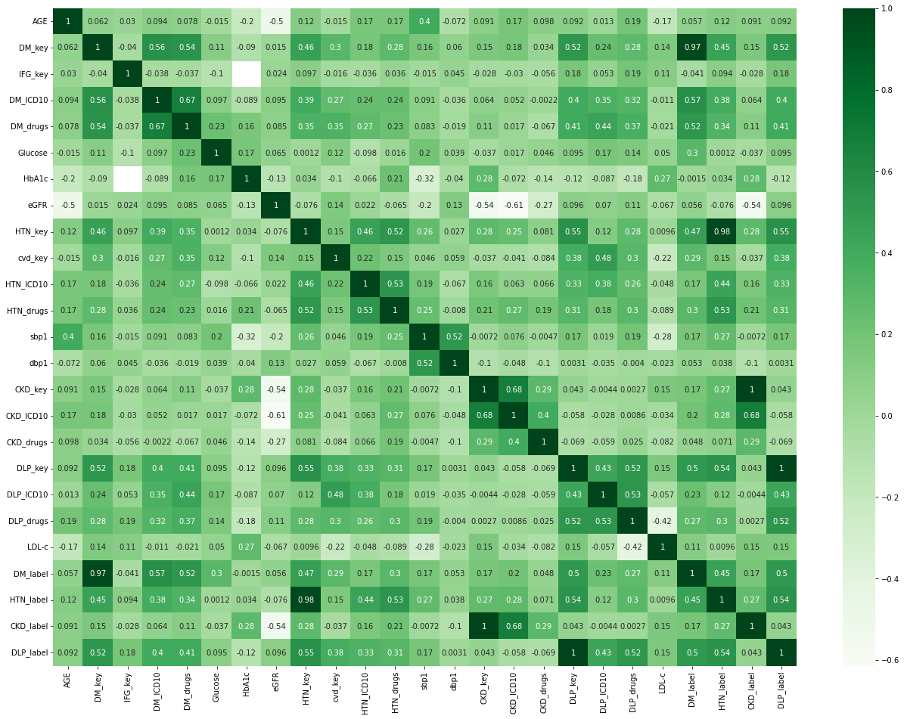
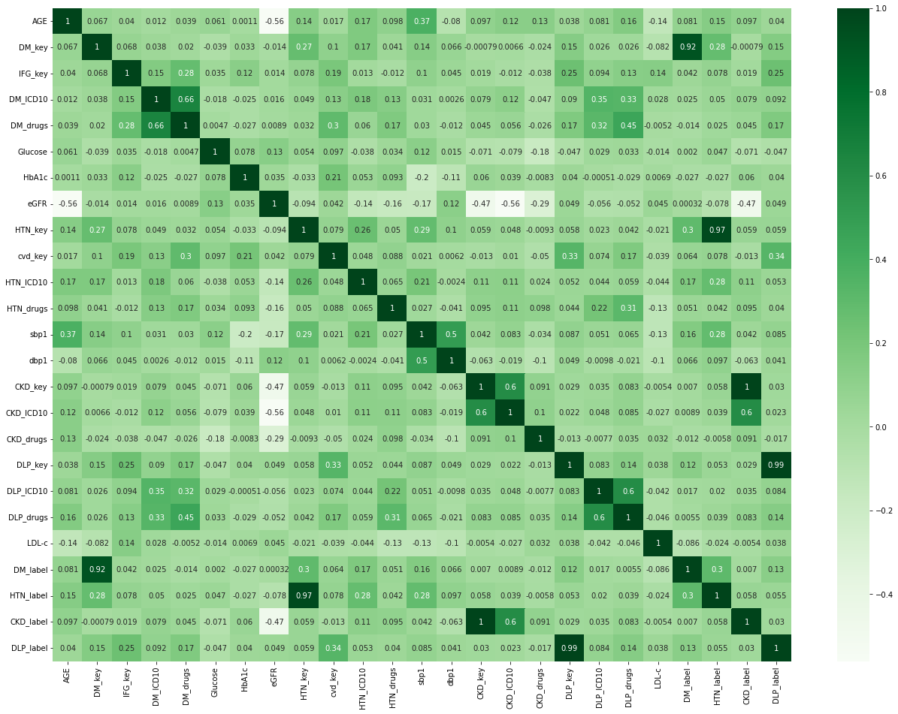

This folder contains experiments as detailed in the paper. See [Experiments.ipynb](Experiments.ipynb) for the code of the experiments performed on a synthetic dataset [NCD_synthetic.csv](NCD_synthetic.csv). Thus the results shown in the notebook are not exactly the same as those in the paper.

The synthetic dataset was generated from [DataSynthesizer](https://github.com/DataResponsibly/DataSynthesizer). See [Generate_synthetic_data.ipynb](Generate_synthetic_data.ipynb) for a step-by-step guide.

To show that the synthetic dataset is a good proxy of the real dataset, we compare their correlation matrices.

Real dataset | Synthetic dataset
--- | ---
 | 
